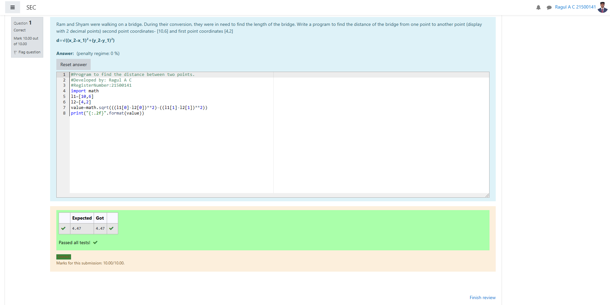

# DISTANCE-BETWEEN-TWO-POINTS

## AIM:
To write a python program to find the distance two 2 points
## ALGORITHM:
### Step 1: 
get two values from the user 
### Step 2:
assing the value of the second variable to a temporary variable 
### Step 3: 
Substitute the values in the distance formula  
### Step 4: 
assing the value in tempory variable to the first variable 
### Step 5: 
print both the values it would be interchanged 
### PROGRAM:
```
#Program to find the distance between two points.
#Developed by: Ragul A C
#RegisterNumber:21500141
import math
l1=[10,6]
l2=[4,2]
value=math.sqrt(((l1[0]-l2[0])*2)-((l1[1]-l2[1])*2))
print("{:.2f}".format(value))
```
### OUTPUT:

### RESULT:
thus the distance between two values are successfully executed 
